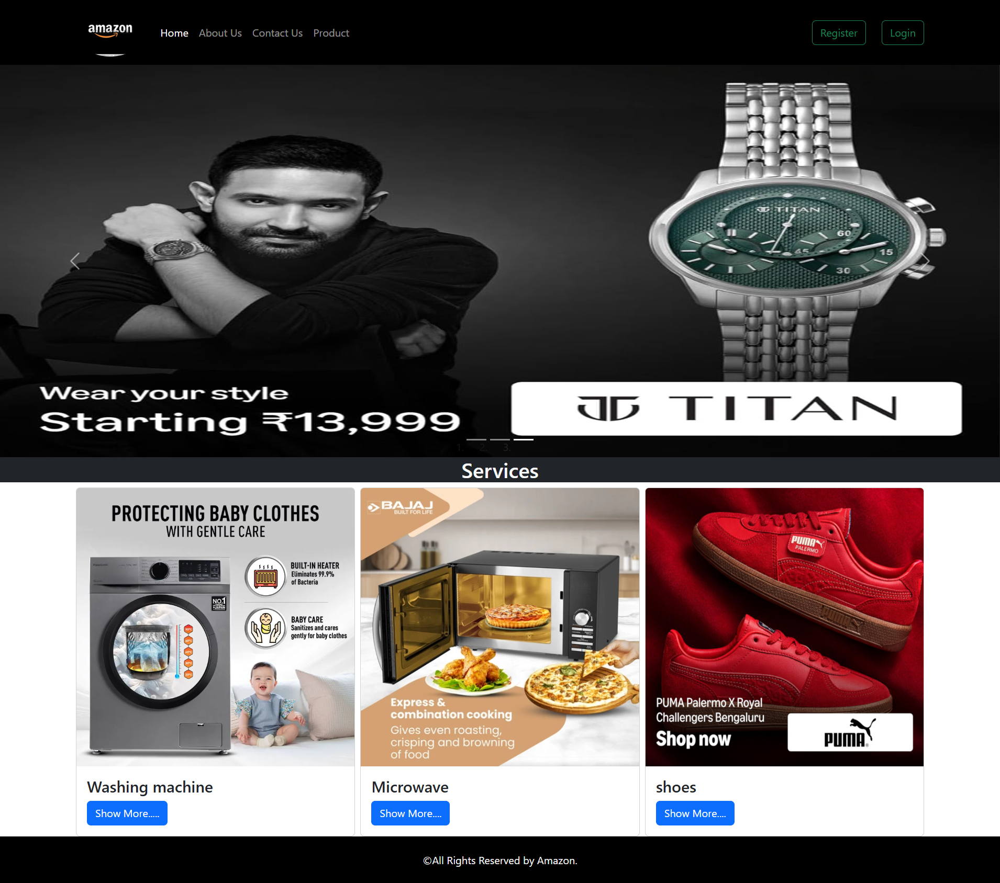
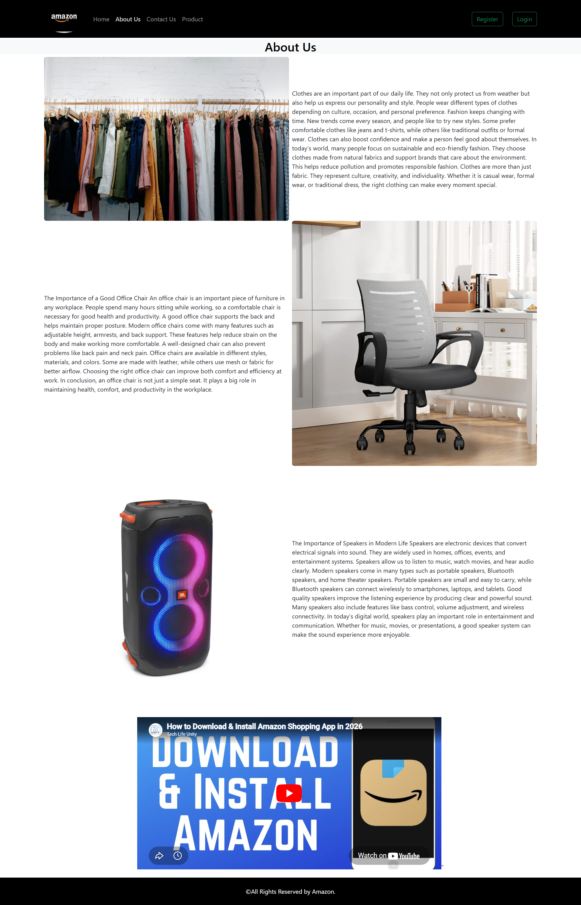
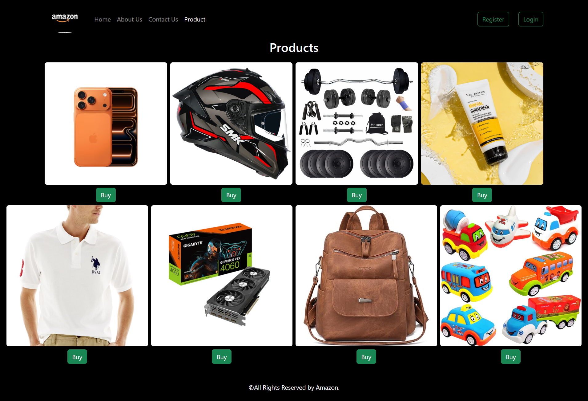
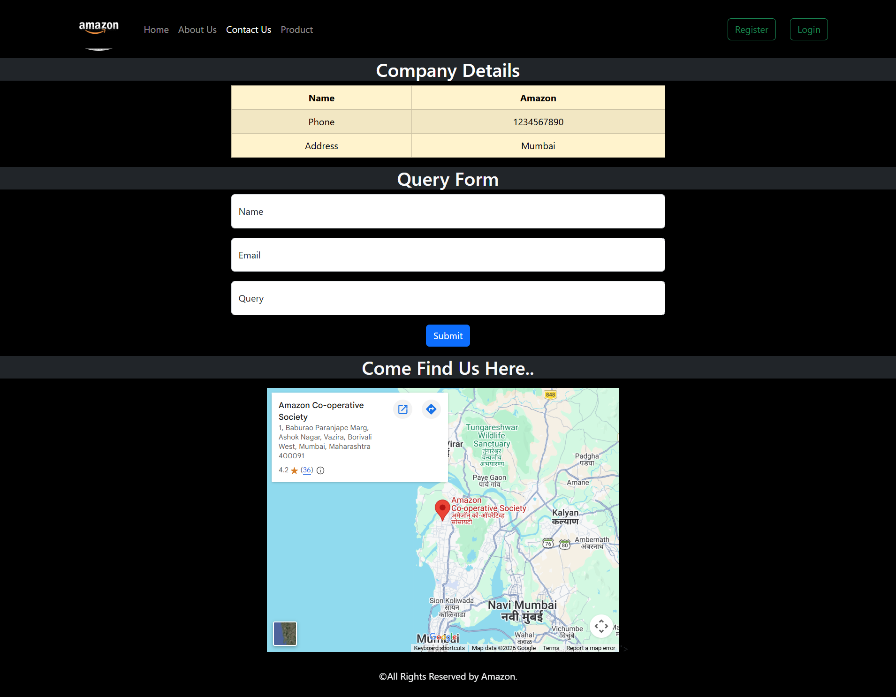
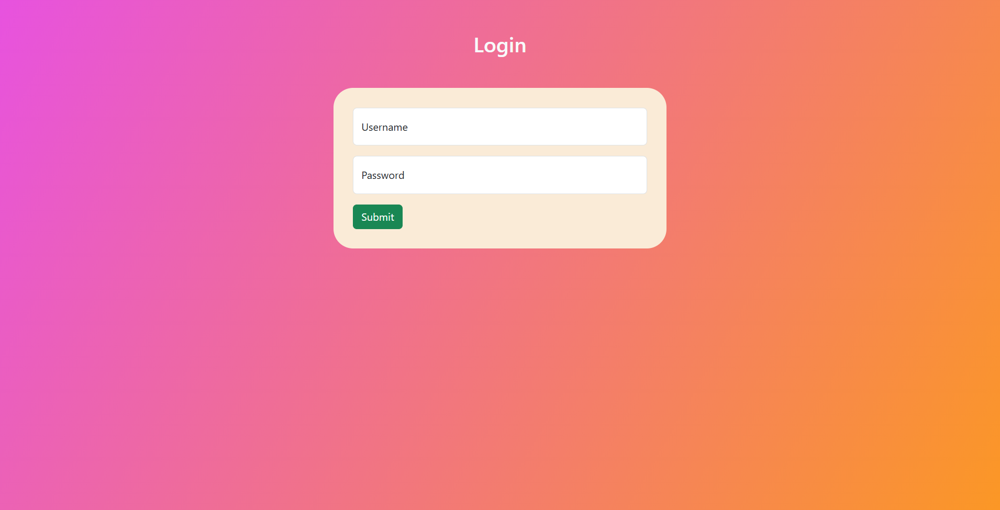
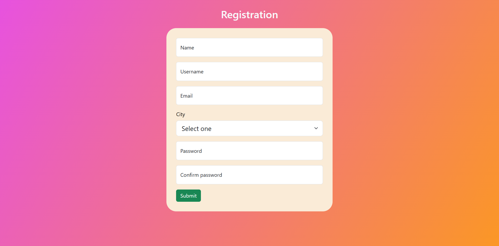

# 📌 Amazon Clone – Frontend Description

**This project is the frontend implementation of an Amazon Clone, designed to replicate the user interface and user experience of a real-world e-commerce platform.**

• Home Page  
• About Page  
• Login Page  
• Register Page  
• Product Page  
• Contact Page

**Home Page 📷**

**About Page 📷**

**Product Page 📷**

**Contact Page 📷**

**Login Page 📷**

**Register page 📷**

